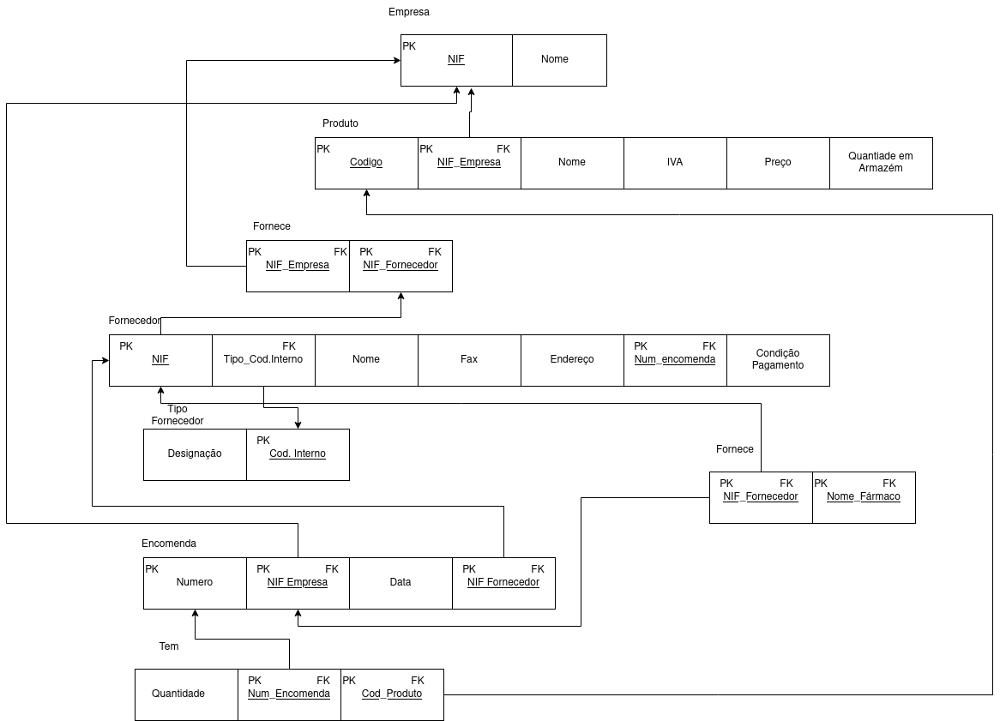

# BD: Guião 3


## ​Problema 3.1
 
### *a)*

```

Cliente         -> NIF, num_carta, endereço, nome 

Aluger          -> numero, duração, data, NIF_cliente, numero_balcao, Matricula_veiculo

Balcao          -> numero, nome, endereço

Veiculo         -> matricula, marca, ano, codigo_tipo

Tipo_veiculo    -> codigo, arcondicionado, designacao

Similaridade    -> codigo_veiculo1,codigo_veiculo2

Ligeiro         -> codigo_tipo, numlugares, portas, combustivel
    
Pesado          -> codigo_tipo, peso, passageiros

```


### *b)* 

```
| Tabela       | Chaves Candidatas                 | Chaves Primárias                  | Chaves Estrangeiras                            |
|--------------|-----------------------------------|-----------------------------------|------------------------------------------------|
| Cliente      | NIF, num_carta                    | NIF                               | -                                              |
| Aluguer      | numero                            | numero                            | NIF_cliente, numero_balcao,  matricula_veiculo |
| Balcao       | numero  endereço                  | numero                            | -                                              |
| Veiculo      | matricula                         | matricula                         | codigo_tipo                                    |
| Tipo_veiculo | codigo                            | codigo                            | -                                              |
| Similaridade | codigo_veiculo1 + codigo_veiculo2 | codigo_veiculo1 + codigo_veiculo2 | codigo_veiculo1 + codigo_veiculo2              |
| Ligeiro      | codigo_tipo                       | codigo_tipo                       | codigo_tipo                                    |
| Pesado       | codigo_tipo                       | codigo_tipo                       | codigo_tipo                                    |
```


### *c)* 


## ​Problema 3.2

### *a)*

```

Airport         airport_code, city, state, name),
Flight_leg      (leg_no, number_flight, airport_code1, arr_time, airport_code2, dep_time),
Flight          (number, airline, weekdays),
Fare            (code, amount, restrictions, number_flight),
Leg_instance    (no_avail_seats, Date,leg_no,number_flight ,airplane_id, arr_time, dep_time,airport_code1, airport_code2),
Seat            (seat_no, customer_name, cphone, date, leg_no, number_flight),
Airplane        (airplane_id, total_seats, type_name)
Airplane_type   (type_name, max_seats, company),
Can_land        (type_name,airport_code),

```


### *b)* 

```
... Write here your answer ...
```


### *c)* 


## ​Problema 3.3


### *a)* 2.1



### *b)* 2.2


### *c)* 2.3


### *d)* 2.4

